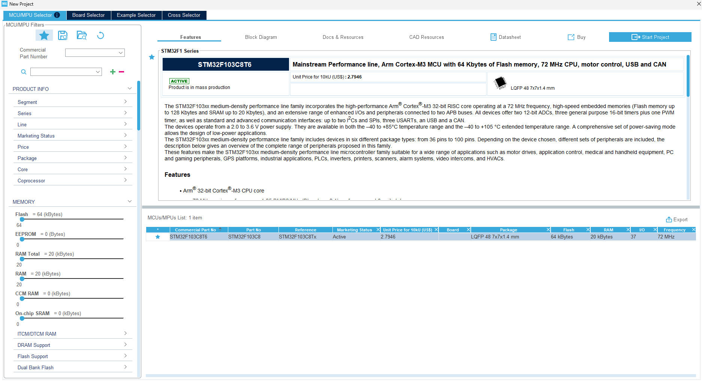
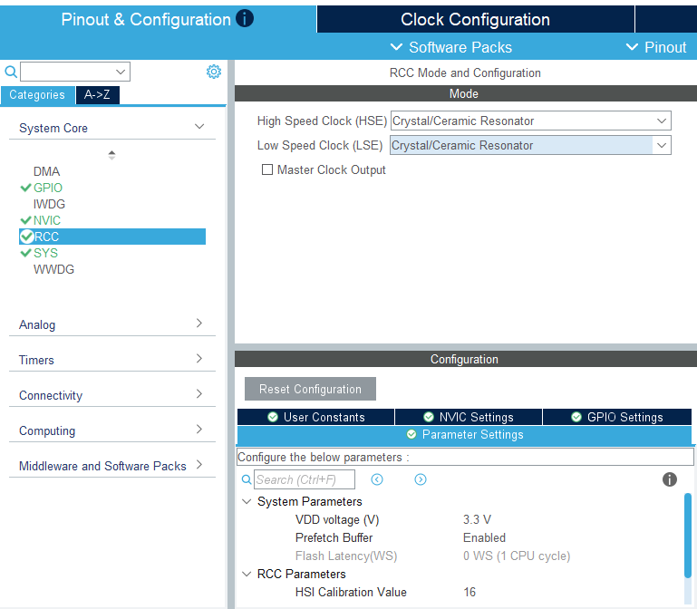
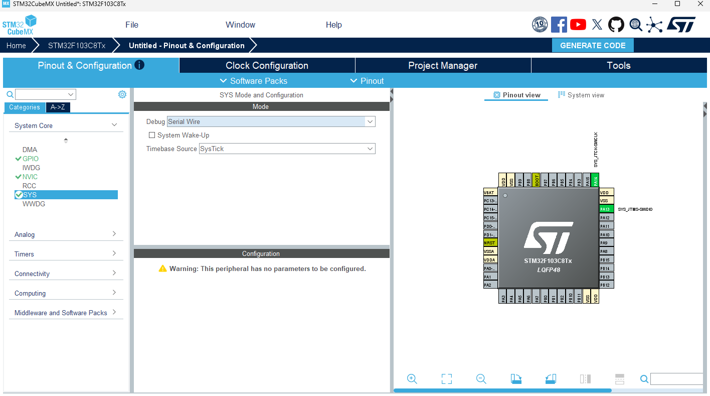
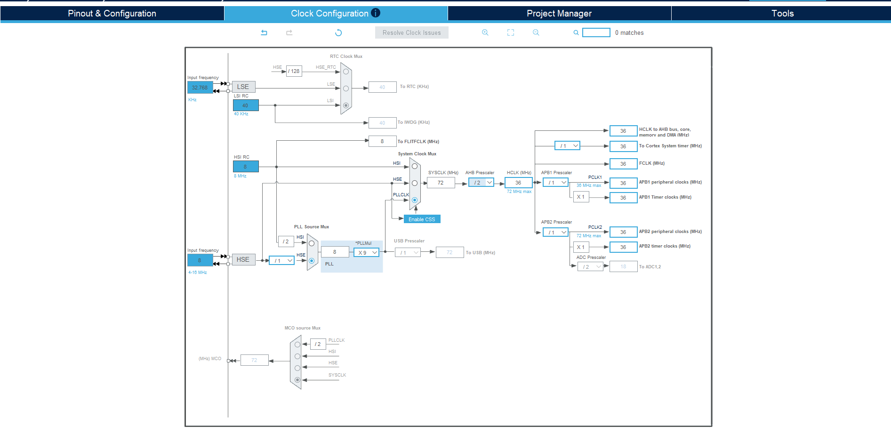
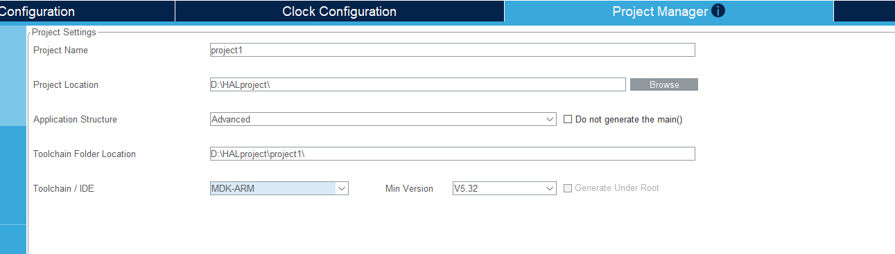
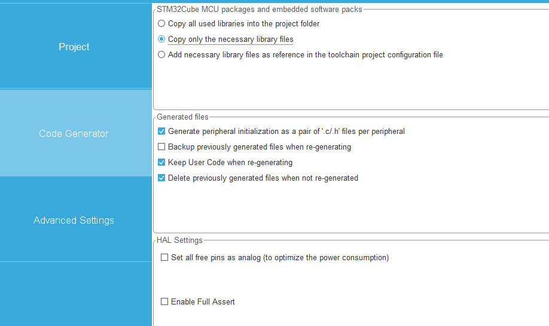

---

## STM32CubeMX 新建工程完整步骤

### 1. 新建工程

- 打开 STM32CubeMX，点击 **File → New Project**
- 在搜索框输入芯片型号（如 `STM32F103C8T6`），双击选中
  

---

### 2. 配置时钟源（RCC）

- 左侧 **Pinout & Configuration → System Core → RCC**
- `High Speed Clock (HSE)` 选 **Crystal/Ceramic Resonator**（使用外部晶振）
  

时钟信号是单片机的"心跳"，有以下核心作用：

## 1. **同步所有数字电路操作**

单片机内部所有逻辑运算、数据传输都需要在时钟边沿（上升沿或下降沿）触发，就像乐队指挥的节拍，确保各部分协调工作。

## 2. **决定运行速度**

- 时钟频率越高 → 单位时间执行指令越多 → 性能越强
- 例如：72MHz 意味着每秒 7200 万次时钟周期
- 一条指令可能需要 1~多个时钟周期完成

## 3. **控制外设工作频率**

不同外设需要不同时钟：

- **UART** 需要精确波特率时钟（如 9600bps）
- **ADC** 需要特定采样时钟（通常几 MHz）
- **定时器** 根据时钟计算定时时间
- **SPI/I2C** 通信速率由时钟决定

## 4. **影响功耗**

- 时钟频率越高 → 功耗越大
- 低功耗模式会降低或关闭部分时钟
- 不用的外设可以关闭其时钟以省电

## 5. **保证时序正确**

数字电路的建立时间、保持时间都依赖时钟，时钟不稳定会导致数据错误或系统崩溃。

---

**类比**：时钟就像工厂的生产节拍铃声，铃响一次，所有工位同步完成一个动作。没有铃声，工人就不知道何时开始下一步，整个流水线会乱套


时钟树是STM32微控制器中时钟信号的分配和管理系统。

简单来说，它描述了从时钟源（如外部晶振、内部RC振荡器）到各个外设的时钟信号传递路径。就像一棵树：

- **根部**：时钟源（HSE外部高速时钟、HSI内部高速时钟、LSE/LSI低速时钟等）
- **主干**：PLL锁相环倍频后的系统时钟（SYSCLK）
- **分支**：通过预分频器（AHB、APB1、APB2等总线分频器）分配给不同外设

**为什么重要？**

- 不同外设需要不同频率的时钟
- 合理配置可以降低功耗
- 时钟频率直接影响MCU性能和外设工作速度
- 配置错误会导致系统无法正常工作

在STM32CubeMX中可以图形化配置时钟树，工具会自动计算各级分频系数，确保时钟配置合法。


## STM32CubeMX 时钟树配置（以 F103C8T6 为例）

### 第一步：配置时钟源（RCC）

先决定时钟从哪里来：

- **Pinout & Configuration → System Core → RCC**
- `High Speed Clock (HSE)` → 选 **Crystal/Ceramic Resonator**（使用外部8MHz晶振）

### 第二步：进入时钟树配置页

点击顶部 **Clock Configuration** 标签，会看到完整的时钟树图。

### 第三步：配置关键参数

F103 的典型72MHz最高频配置路径：

```
HSE(8MHz) → PLL倍频(×9) → SYSCLK(72MHz)
                              ↓
                    AHB分频(/1) → HCLK(72MHz) → CPU/DMA/Flash
                              ↓
                    APB1分频(/2) → PCLK1(36MHz) → 低速外设(UART2/3, SPI2, I2C)
                              ↓
                    APB2分频(/1) → PCLK2(72MHz) → 高速外设(UART1, SPI1, GPIO)
```

具体操作：

1. 在 `PLL Source Mux` 选 **HSE**
2. `PLLMul` 设为 **×9**
3. `System Clock Mux` 选 **PLLCLK**
4. `HCLK` 输入 **72** → 按 Enter

### 第四步：自动修复

如果有配置冲突，点击 **Resolve Clock Issues**，CubeMX 会自动计算分频系数。

---

**最快方法**：直接在 `HCLK` 框输入目标频率（如 `72`），然后按 Enter，CubeMX 会自动反推所有分频和倍频参数。
---

### 3. 配置调试接口（SYS）

- **System Core → SYS**
- `Debug` 选 **Serial Wire**（SWD 调试）
  

---

### 4. 配置时钟树（Clock Configuration）

- 点击顶部 **Clock Configuration** 标签
- 设置 HCLK 频率（如 F103 最高 72MHz）
- 点击 **Resolve Clock Issues** 或手动配置 PLL
  

---

### 5. 配置外设（按需）

- 在 **Pinout & Configuration** 中启用需要的外设（GPIO、UART、SPI、I2C 等）
- 配置对应参数（波特率、模式等）

---

### 6. 配置工程设置

- 点击顶部 **Project Manager** 标签
- **Project Name**：填写工程名
- **Project Location**：选择保存路径（路径不要有中文）
- **Toolchain/IDE**：选 **MDK-ARM**
- **Min Version**：选对应的 Keil 版本（如 V5）

---

### 7. 配置代码生成选项

- 切换到 **Code Generator** 子标签
- 勾选 **Copy only the necessary library files**（只复制用到的库，减小体积）
- 勾选 **Generate peripheral initialization as a pair of '.c/.h' files**（外设分文件生成，结构更清晰）
  

---

### 8. 生成代码

- 点击右上角 **GENERATE CODE**
- 弹窗提示后点击 **Open Project**，自动在 Keil 中打开工程

---

### 9. Keil 中编译验证

- 点击编译按钮（F7），确认 **0 Error, 0 Warning**
- 工程结构中用户代码写在 `/* USER CODE BEGIN */` 和 `/* USER CODE END */` 之间，重新生成代码时不会被覆盖